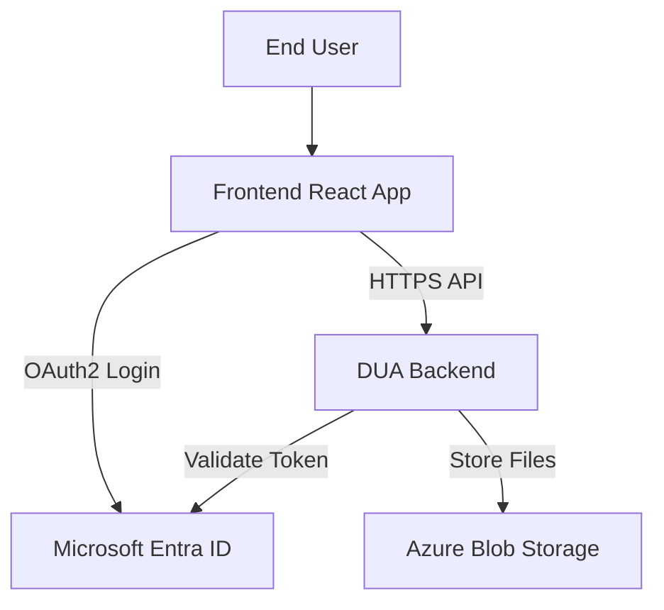
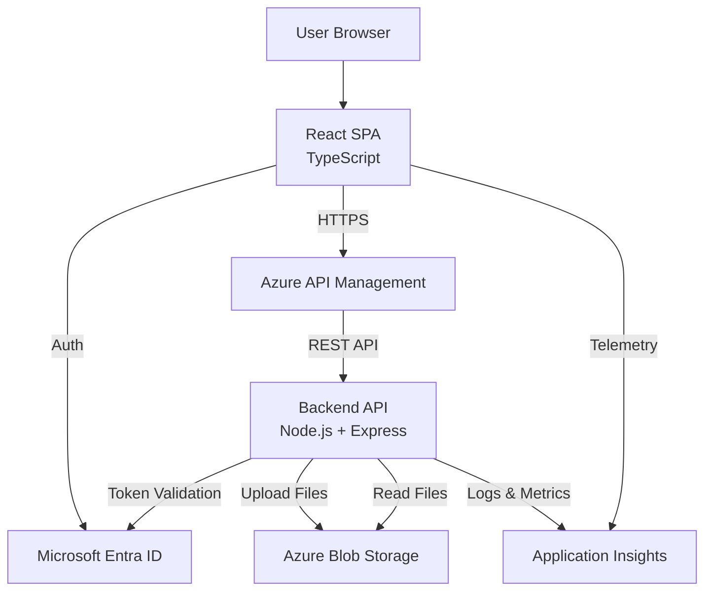
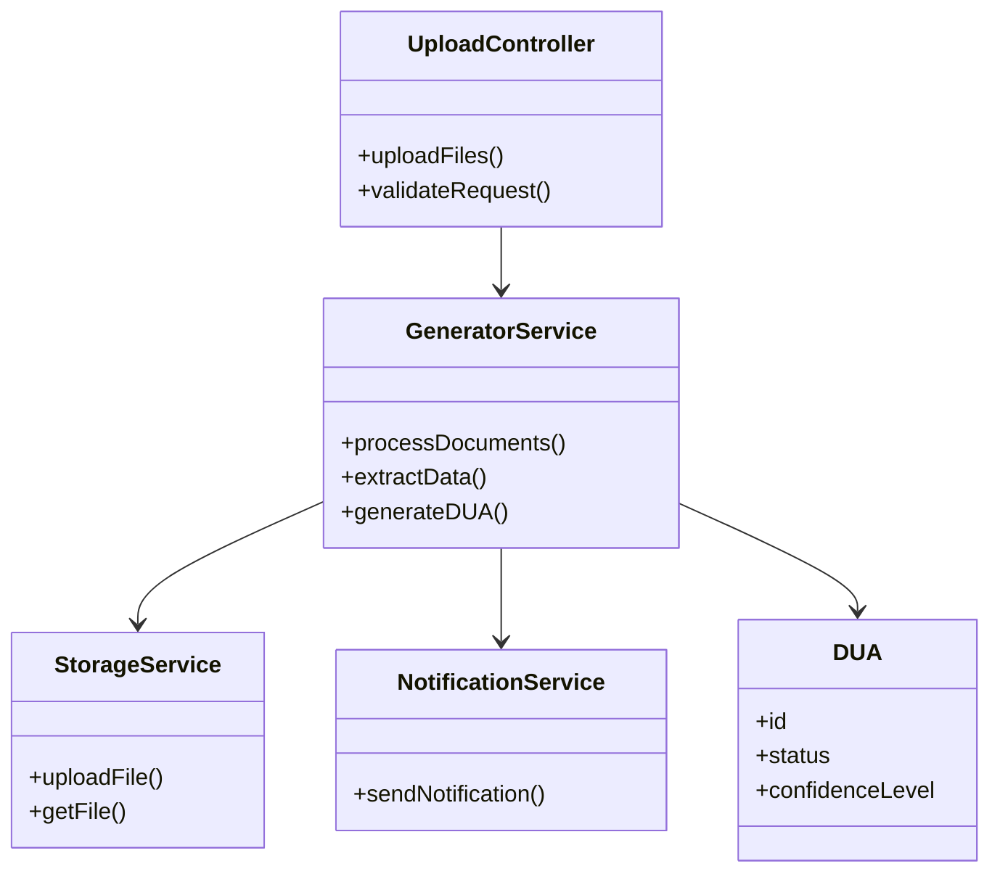

# DUA Streamliner

## Problem Statement

The preparation of the DUA is a critical step in import and export operations in Costa Rica. The DUA consolidates key information about the importer or exporter, consignee, goods description, customs regime, declared values, taxes, transportation details, and supporting documentation.

Currently, the DUA is completed manually by interpreting multiple source documents such as commercial invoices, packing lists, certificates of origin, bills of lading, insurance policies, and special permits. These documents may come in different formats including Excel files, Word documents, PDFs, and scanned images.

Because these documents do not follow a standardized structure and may vary significantly between suppliers or companies, the interpretation process requires specialized domain knowledge. As a result, the preparation of the DUA becomes:

- Time-consuming and operationally repetitive  
- Highly dependent on expert interpretation  
- Prone to human errors and inconsistencies  
- Vulnerable to delays, penalties, or customs rejections  

In addition, extracting relevant data from heterogeneous document formats requires manual reading, cross-checking values, validating totals, and mapping information into the official DUA template defined by the Costa Rican customs authority.

This project aims to design an intelligent system capable of automating the reading, semantic extraction, validation, and mapping of information from multiple document sources into the official DUA template. The goal is not to replace customs experts, but to transform their role from manual data entry operators into strategic validators, reducing operational workload and minimizing errors.

---

## Authors

- Andrés Ramírez Madrigal  
- Ignacio Cordero Chinchilla

# 1. Frontend Design

## 1.1 Technology stack

- Application Type: Web Application
- Web Framework: Next.js v15.x (React v19.2)
- Web Server: Node.js v21
- Coding Language: TypeScript v5.9.3

- Unit Testing Framework: Jest v30.2.0
- Integration Testing Tool: Playwright v1.58.2
- Data Validation Framework: Zod v3.23.8

- Code Formatter: Prettier v3.3.3
- Code Style Framework: ESLint v9.10.0
- Code Automation Task Tool: Husky v9.1.7

- Cloud Service: Microsoft Azure
- Hosted Service within Cloud: Azure App Service

- Code Repository Service: Azure DevOps Repos
- CI/CD Pipelines Technology: Azure DevOps Pipelines

- Environments: Development, QA, Staging, Production
- Environment Deployment Tools: Azure DevOps Environments + Azure App Service Deployment Slots

- Observability Framework: Azure Application Insights SDK v3.x

## 1.2 UX UI analysis: 

### Usability Attributes

- Learnability  
The system provides a linear and guided workflow (login → configuration → monitoring → result), allowing new users to quickly understand how to use the application.

- Efficiency  
Users can complete the DUA generation process with minimal steps by selecting documents and templates within a single flow.

- Error Prevention  
The system validates documents and templates before starting the generation process, reducing the likelihood of failures.

- Feedback  
The system continuously informs the user about the process status, including validation errors, processing stages, and completion notifications.

- Consistency  
All interactions follow a consistent workflow and predictable behavior across all screens.

- Simplicity  
The interface is designed to minimize complexity and avoid unnecessary actions or decisions.

- Visibility of System Status  
The system clearly communicates processing stages and data confidence levels, ensuring users always understand the current state of the operation.

### Core Business Process

This section describes the user interaction flow across the main screens of the application. The description focuses only on user actions and system responses.

---

#### 1. Login

1. The user accesses the system and provides their login credentials and a one-time authentication token.

2. The user submits the authentication information to access the system.

3. If the authentication fails, the system informs the user that the username or password is invalid.

4. If the authentication is successful, the system grants access and redirects the user to the generator configuration process.

---

#### 2. Configure the Generator

1. The user accesses the generator configuration section to prepare a new DUA generation process.

2. The user selects the folder that contains the source documents required to extract the necessary information.

3. The system reads the folder and verifies that supported document formats are present.

4. If no valid documents are detected, the system informs the user that the selected folder does not contain supported files.

5. The user selects the official DUA template that will be used to generate the final document.

6. The system verifies that the selected template is valid and compatible with the generation process.

7. The user confirms the configuration in order to start the generation process.

8. The system validates the provided information and configuration parameters.

9. If the configuration contains invalid or incomplete information, the system informs the user that the configuration must be corrected.

10. If the configuration is valid, the system stores the configuration and initializes the document processing and information extraction process.

11. Once the generation process begins, the user is redirected to the monitoring section.

---

#### 3. Monitoring the Progress

1. The user accesses the monitoring section to track the progress of the generation process.

2. The system continuously updates the current state of the process and informs the user about the stages of document processing, data extraction, and template population.

3. If the process encounters an error while reading or interpreting the source documents, the system informs the user that the generation process failed.

4. If the process completes successfully, the system notifies the user that the generated DUA document is ready to be obtained.

---

#### 4. Obtain the Result / Export

1. The user accesses the generated results once the process has finished.

2. The system prepares the generated DUA document and makes it available for retrieval.

3. The user requests the export of the generated results.

4. The system processes the export request and delivers the generated DUA file.

---

#### 5. Logout

1. The user decides to terminate the session.

2. The system invalidates the active session and returns the user to the initial access screen.

### Wireframes

#### Login Screen

This screen allows the user to authenticate into the system using their username, password, and one-time authentication token.

---

#### Configure Generator

This screen allows the user to configure the DUA generation process.  
The user selects the folder containing the source documents and chooses the official DUA template that will be used for the generation process.

---

#### Monitoring Progress

This screen allows the user to monitor the progress of the document processing and information extraction process.  
The system displays the different stages involved in generating the DUA document.

---

#### Result / Export

This screen allows the user to retrieve the generated DUA document once the process has finished successfully.

---

#### Logout

This screen allows the user to confirm the termination of the active session.

---

### UX Testing Results

A usability test was conducted with three participants who are not familiar with software design.

The objective of the test was to evaluate how intuitive the wireframes are by analyzing where users naturally clicked when attempting to complete each task.

#### Testing Method

Participants were asked to complete tasks corresponding to the main workflow (login, configuration, monitoring, and export).

The test did not require users to click on exact interactive elements. Any click was considered as task completion. This approach allowed observation of user intuition and interaction patterns based on where they expected actions to occur.

#### Metrics

- Number of participants: 3  
- Task completion rate: 100%  
- Interaction analysis: Based on click distribution (heatmaps)  
- Misclicks: Observed through clicks outside expected interaction areas  

#### Observations

- Users consistently clicked on areas that aligned with expected interaction zones across most screens.
- The login, monitoring, and result stages were clearly understood by all participants.
- Interaction patterns indicate that the layout and structure effectively guide user actions.
- Minor variations in click behavior were observed but did not affect task completion.

#### Insights

- The overall workflow is intuitive and easy to follow, even for users without prior knowledge of the system.
- Visual hierarchy and element positioning successfully communicate possible actions.
- The interface supports natural user interaction with minimal confusion.

#### Improvements Identified

- Minor refinements can be made to further reinforce key interaction areas.
- Additional visual cues could improve clarity in edge cases without impacting the current usability.

### UX Testing Evidence

#### Heatmap - Login Screen

#### Heatmap - Configure Generator

#### Heatmap - Monitoring Progress

#### Heatmap - Result

#### Heatmap - Logout

## 1.3 Component Design Strategy

The frontend component design follows a structured and reusable approach based on Atomic Design principles, combined with centralized styling, internationalization, and responsive design strategies.

---

### Component Design Technique

The application uses the Atomic Design methodology to structure UI components into hierarchical levels:

- **Atoms**  
  Basic UI elements such as buttons, inputs, labels, icons, and loaders.

- **Molecules**  
  Combinations of atoms forming functional units, such as form fields, file selectors, and status indicators.

- **Organisms**  
  Complex UI sections composed of multiple molecules, such as:
  - Login form
  - Generator configuration panel
  - Progress monitoring panel
  - Data review table

- **Templates**  
  Page-level layouts that define structure without specific data.

- **Pages**  
  Fully instantiated views connected to application state and API data.

This structure ensures scalability, separation of concerns, and maintainability.

---

### Component Reusability Strategy

Reusability is achieved through:

- Clear separation between presentational and container components  
- Stateless UI components (atoms and molecules)  
- Prop-driven configuration for flexible behavior  
- Shared hooks for logic reuse (e.g., `useAuth`, `useGenerator`, `useMonitoring`)  
- API abstraction through adapters, preventing coupling with backend structures  

---

### Styling & Branding Strategy

Styling is centralized using a design system approach:

- Tailwind CSS is used for utility-based styling  
- Global design tokens define:
  - Colors (including confidence levels: green, yellow, red)
  - Typography
  - Spacing and layout rules  

- A shared theme configuration ensures consistent branding across all components, including colors, typography, and visual identity aligned with the system purpose  

- UI states (hover, focus, error, loading) are standardized across the application  

---

### Internationalization (i18n)

Internationalization is implemented using a centralized translation system:

- All user-facing text is managed through translation files  
- Components consume translations via hooks (e.g., `useTranslation`)  
- Language switching is handled globally without affecting component structure  

This ensures scalability for multi-language support without modifying component logic.

---

### Responsiveness Strategy

The application is fully responsive and adapts to different screen sizes:

- Mobile-first design approach  
- Responsive breakpoints defined in the styling system  
- Flexible layouts using grid and flexbox  
- Components designed to adapt dynamically (e.g., tables collapse into cards on smaller screens)  

---

### State & UI Synchronization

Components remain synchronized with application state through:

- Server state handled by React Query (data fetching, caching, polling)  
- Client state handled via lightweight global stores  
- Real-time UI updates for:
  - Processing status
  - Data confidence visualization
  - Error and success feedback  

---

### Key Design Principles

- Separation of concerns  
- High cohesion and low coupling  
- Reusability and scalability  
- Predictable state management  
- Clear visual communication (especially for AI confidence levels)  

---

### Implementation Conventions

The component design follows specific implementation conventions to ensure consistency and alignment with project standards:

- **Atomic Design Usage**  
Components follow the previously defined Atomic Design structure.

- **CSS Centralization**  
Each component type maintains a single centralized style file to ensure consistency and avoid style duplication.

- **CSS Naming Convention**  
CSS class names follow a structured pattern:  
`ComponentName-StyleName`  

- **Responsive Units**  
All positional and layout units use `em` to ensure consistent scalability and responsiveness across devices.

- **Internationalization Support**  
All components are compatible with `react-i18next v16.5.8`, ensuring that text content is fully externalized and translatable.

- **Accessibility**  
Accessibility requirements are not considered within the scope of this implementation.

## 1.4 Security

The frontend security design defines authentication, authorization, and session management mechanisms, including the responsible technologies, techniques, and classes within the project structure.

---

### Authentication

- Identity Provider: Microsoft Entra ID  
- Authentication Model: Single Sign-On (SSO)  
- Multi-Factor Authentication (MFA): Enabled via mobile authenticator  
- Protocol: OAuth 2.0 / OpenID Connect  

Authentication is fully delegated to Microsoft Entra ID using:

- `@azure/msal-browser`
- `@azure/msal-react`

---

### Authorization

The system uses Role-Based Access Control (RBAC).

#### Roles

- **Manager**
- **Customs Agent**

#### Permissions by Role

**Manager**
- `MANAGE_USERS` → Manage user CRUD operations  
- `VIEW_REPORTS` → Access operational and performance reports  
- `EDIT_TEMPLATES` → Modify DUA templates  

**Customs Agent**
- `LOAD_FILES` → Upload and configure document folders  
- `GENERATE_DUA` → Start DUA generation process  
- `DOWNLOAD_DUA` → Export generated DUA document  

---

### Frontend Authorization Strategy

Authorization is enforced through:

- Protected routes  
- Permission-based UI rendering  
- Route guards validating user roles and scopes  

---

### Session Management

- Token acquisition and caching handled by MSAL  
- Storage strategy:
  - `sessionStorage` for session persistence  
  - `memoryStorage` (optional for higher security)  

- Session lifecycle:
  - Session starts after successful authentication  
  - Session is invalidated on logout  
  - Cached data is cleared after session termination  

---

### Security Classes and Location

Security responsibilities are encapsulated in dedicated classes located within the frontend project structure:

#### `/src/security/AuthService.ts`
- Handles login, logout, and token acquisition  
- Wraps MSAL functionality  

#### `/src/security/SessionManager.ts`
- Manages session lifecycle  
- Handles token storage and cleanup  

#### `/src/security/AuthorizationService.ts`
- Validates user roles and permissions  
- Provides helper methods such as:
  - `hasRole(role)`
  - `hasPermission(permission)`

#### `/src/security/AuthGuard.tsx`
- Protects routes and components  
- Redirects unauthorized users  

---

### Data Storage Strategy

#### Public Configuration (Frontend)

Stored as environment variables:

- API base URL  
- Environment name  
- Entra ID tenant ID and client ID  

---

#### Sensitive Data

Stored in:

- **Azure Key Vault**

Includes:
- API keys  
- Secrets  
- Certificates  

Sensitive data is never exposed to the frontend.

---

### Secure Storage Service

- Azure Key Vault  

Used for secure storage of:
- Secrets  
- Keys  
- Certificates  

Access controlled through Azure RBAC.

---

### Environment Configuration Flow

1. Secrets stored in Azure Key Vault  
2. Azure DevOps retrieves secrets securely  
3. Deployment injects configuration into Azure App Service  
4. Frontend consumes only non-sensitive variables  
5. Backend securely accesses sensitive data  

## 1.5 Layered Design

The frontend application follows a layered architecture to ensure separation of concerns, scalability, and maintainability.

---

### Rendering Flow

The frontend performs Server-Side Rendering (SSR) using Node.js and React in Azure App Service.

- If no authenticated session exists, the Authentication Layer is invoked  
- If authentication is successful, the visual resource is rendered through the Components Layer  

---

### Authentication Layer

Responsible for handling user authentication and session validation.

- Integrates with Microsoft Entra ID using MSAL  
- Manages authentication state and session lifecycle  
- Controls access to protected resources before rendering UI components

--- 

### Components Layer

Responsible for rendering the user interface.

- Follows Atomic Design:
  - Atoms → Molecules → Organisms → Templates → Pages  
- Handles user interaction and visual representation  

Within this layer, a **Hooks Layer** is used to connect UI actions with business logic.

---

### Hooks Layer

Acts as the connection between UI components and application logic.

- Captures user interactions  
- Manages local UI state and side effects  
- Delegates operations to the Services Layer  

---

### Services Layer

Contains the core application operations.

- Handles DUA generation, monitoring, and export processes  
- Orchestrates business logic  
- Coordinates API interactions  

Services may access:

- Utils  
- ApiClients  
- Settings  

---

### ApiClients Layer

Responsible for communication with external APIs.

- Implements HTTP calls using axios  
- Encapsulates endpoints and request logic  
- Reads API URLs and keys from the Settings Layer  

All requests and responses use Models validated by the Data Validation Layer.

---

### Settings Layer

Manages application configuration.

- Reads environment variables from Azure App Service  
- Provides configuration values injected at build or runtime, sourced from Azure Key Vault through secure backend and deployment pipelines.
- Provides API URLs, environment settings, and identifiers  

---

### Data Validation Layer

Ensures data integrity across the system.

- Implemented using Zod  
- Validates all API requests and responses  
- Enforces data contracts using Models  

---

### Models Layer

Defines shared data structures.

- Used across Services, ApiClients, and Components  
- Represents domain entities such as DUA data and process results  

---

### State Management Layer

Manages application state.

- Server state handled by React Query  
- Client state handled by Zustand  

All layers can access state when required.

---

### Notification Service Layer

Handles asynchronous communication.

- Allows layers to subscribe to events  
- Supports callback-based updates from external APIs  
- Used for long-running processes such as DUA generation  

All asynchronous API interactions are handled via callbacks through this layer.

---

### Utils Layer

Provides reusable helper functions.

- Shared across all layers  
- Includes formatting, parsing, and common logic  

---

### Logging Layer

Responsible for system monitoring.

- Registers events and errors  
- Sends logs to Azure Application Insights via ApiClients  

---

### Exception Handling Layer

Provides centralized error handling.

- Standardizes error responses  
- Prevents application crashes  
- Shared across all layers  

---

### Layer Interaction Rules

- Components interact only with Hooks  
- Hooks interact with Services  
- Services interact with ApiClients, Utils, and Settings  
- ApiClients interact with external APIs  
- All layers can access Models, Utils, and State Management  
- Asynchronous communication is handled through the Notification Service Layer  

---

### High-Level Flow

User → Browser → Azure App Service → SSR → Authentication → Components → Hooks → Services → ApiClients → External APIs  

External APIs → Notification Service → Services → Hooks → Components → UI Update  

## 1.6 Design Patterns

The frontend applies object-oriented design patterns to ensure scalability, maintainability, and clear separation of responsibilities across the application.

---

### Adapter Pattern

Used to decouple frontend logic from backend API structures.

#### Purpose
- Transform API responses into frontend-friendly models  
- Isolate changes in backend contracts  

#### Classes and Location

- `/src/api/adapters/AuthApiAdapter.ts`
- `/src/api/adapters/GeneratorApiAdapter.ts`
- `/src/api/adapters/MonitoringApiAdapter.ts`
- `/src/api/adapters/ExportApiAdapter.ts`

#### Responsibilities

- Delegate HTTP communication to the ApiClients layer  
- Map responses to Models  
- Handle API errors consistently  

---

### Observer Pattern (Notification Service)

Used for event-driven communication and asynchronous updates.

#### Purpose
- Notify components about long-running processes  
- Enable subscription to backend events  

#### Classes and Location

- `/src/services/NotificationService.ts`

#### Responsibilities

- Manage event subscriptions  
- Dispatch updates to subscribers  
- Handle callback-based communication for async processes  

---

### Singleton Pattern

Used to ensure a single shared instance of critical services.

#### Purpose
- Centralize shared logic  
- Avoid duplicated instances across the application  

#### Classes and Location

- `/src/security/AuthService.ts`
- `/src/security/SessionManager.ts`
- `/src/services/NotificationService.ts`
- `/src/services/TelemetryService.ts`
- `/src/config/SettingsService.ts`
- `/src/utils/Logger.ts`

#### Responsibilities

- Maintain global state consistency  
- Provide shared access to configuration and services  

---

### Strategy Pattern

Used to define interchangeable behaviors for processing operations.

#### Purpose
- Allow different strategies for handling workflows such as:
  - File validation  
  - Data processing  
  - Export behavior  

#### Classes and Location

- `/src/services/strategies/GenerationStrategy.ts`
- `/src/services/strategies/ValidationStrategy.ts`
- `/src/services/strategies/ExportStrategy.ts`

#### Responsibilities

- Define interchangeable algorithms  
- Allow runtime selection of behavior  

---

### Factory Pattern

Used for controlled object creation.

#### Purpose
- Centralize instantiation logic  
- Avoid direct dependency on concrete implementations  

#### Classes and Location

- `/src/factories/ServiceFactory.ts`

#### Responsibilities

- Create service instances  
- Provide configured objects based on context  

---

### State Management Pattern

Implements centralized state handling.

#### Purpose
- Maintain predictable application state  
- Synchronize UI with backend data  

#### Implementation

- React Query → Server state  
- Zustand → Client state  

#### Location

- `/src/state/`

---

### Guard Pattern (Security)

Used to protect routes and components.

#### Purpose
- Restrict access based on authentication and authorization  

#### Classes and Location

- `/src/security/AuthGuard.tsx`

#### Responsibilities

- Validate user session  
- Check roles and permissions  
- Redirect unauthorized users  

---

### Interceptor Pattern

Used for cross-cutting concerns in API communication.

#### Purpose
- Automatically attach tokens to requests  
- Handle global API errors  

#### Classes and Location

- `/src/api/interceptors/AxiosInterceptor.ts`

#### Responsibilities

- Inject authentication tokens  
- Handle response errors globally  

---

### Error Handling Pattern

Provides centralized exception management.

#### Purpose
- Standardize error handling across the application  
- Prevent UI crashes  

#### Classes and Location

- `/src/core/ExceptionHandler.ts`

---

### Event-Driven Programming

The system follows an event-driven approach for asynchronous operations.

#### Purpose
- Handle long-running processes (DUA generation)  
- Update UI without blocking execution  

#### Implementation

- NotificationService (Observer pattern)  
- React Query polling and cache invalidation  

---

### Summary

The combination of these patterns ensures:

- Loose coupling between layers  
- Reusable and scalable components  
- Clear separation of concerns  
- Robust handling of asynchronous workflows  

## 1.7 Project Scaffold (/src)

The following folder structure represents the frontend scaffold derived from the defined technology stack, layered architecture, component strategy, and design patterns.

- [app](./src/app)
- [api](./src/api)
- [components](./src/components)
- [config](./src/config)
- [core](./src/core)
- [factories](./src/factories)
- [hooks](./src/hooks)
- [i18n](./src/i18n)
- [models](./src/models)
- [security](./src/security)
- [services](./src/services)
- [state](./src/state)
- [styles](./src/styles)
- [types](./src/types)
- [utils](./src/utils)
- [validation](./src/validation)

## 2. Backend Design

### 2.1 Technology Stack

The backend design explicitly defines the application protocols, API style, business logic paradigm, and hosting model.

---

#### Application and Transport Protocols

- Transport Protocol: HTTPS over TLS (HTTP/1.1 and HTTP/2)
- All communication is secured using TLS encryption
- HTTP/2 is preferred for improved performance in concurrent requests

---

#### API Style

- API Type: REST API
- API Standard: OpenAPI Specification (Swagger)

REST is selected due to:

- Simplicity and wide adoption
- Compatibility with web clients
- Built-in support for HTTP caching and status codes
- Ease of integration with external systems

---

#### Business Logic Paradigm

The system uses a hybrid approach:

- Synchronous (Request/Response):
  - Used for API operations such as authentication, configuration, and data retrieval

- Asynchronous Processing:
  - Used for DUA generation workflows (document processing, extraction, mapping)
  - Implemented using event-driven patterns and notification mechanisms

This approach ensures responsiveness while handling long-running operations efficiently.

---

#### API Exposure Layer

- API Gateway: Azure API Management
  - Handles routing, rate limiting, authentication, and monitoring
  - Exposes documented endpoints using OpenAPI

- No BFF layer is required due to a single frontend client

---

#### Hosting Model

- Cloud Provider: Microsoft Azure
- Hosting Service: Azure App Service (PaaS)

This model provides:

- Managed infrastructure
- Automatic scaling capabilities
- Simplified deployment and maintenance

---

#### Asynchronous Communication

- Azure Notification Hubs is used for:
  - Event notifications
  - Process updates to the frontend
  - Decoupling long-running operations

---

#### Backend Runtime and Framework

- Runtime: Node.js v21
- Programming Language: TypeScript v5.9.3
- Web Framework: Express.js

This stack is selected due to:

- Alignment with frontend (TypeScript)
- High performance for I/O operations
- Strong ecosystem and developer productivity

---

#### Architecture Style

- Modular Monolith (Service-based architecture)

This approach allows:

- Clear separation of concerns through services
- Easier development and deployment compared to microservices
- Future scalability towards distributed architecture if needed

---

#### Load Balancing

- No explicit load balancer is required
- Traffic distribution is handled by Azure App Service and API Management

---

#### Repository Strategy

- Monorepo structure shared with frontend
- Backend located in: `/duabusiness`

This enables:

- Shared configurations
- Easier CI/CD integration
- Consistent versioning

### 2.2 Security

The backend security design ensures secure communication, controlled access, and protection of sensitive data across all system components.

---

#### Authentication vs Authorization

- Authentication is handled using Microsoft Entra ID (OAuth 2.0 / OpenID Connect)
- Users authenticate via external identity provider (SSO)

- Authorization is enforced in the backend using:
  - JWT access tokens
  - Role-Based Access Control (RBAC)
  - Scope validation per endpoint

---

#### Token Management (JWT)

- All protected endpoints require a valid JWT access token
- Token validation includes:
  - Signature verification
  - Expiration validation
  - Issuer and audience validation

- Token policies:
  - Short-lived tokens (recommended: 15–60 minutes)
  - Token refresh handled via frontend (MSAL)
  - No sensitive data stored inside tokens

---

#### Communication Security

- All API communication is secured using HTTPS (TLS 1.2 or higher)
- Data in transit is encrypted end-to-end
- HTTP requests without TLS are rejected

---

#### Data Encryption (At Rest)

- Sensitive data is encrypted using AES-256
- Encryption keys are managed through Azure Key Vault
- Storage services (Azure Blob Storage) use server-side encryption by default

---

#### Secrets Management

- All secrets are stored in Azure Key Vault
- Includes:
  - API keys
  - Connection strings
  - Encryption keys

- Secrets are never stored in source code or repositories
- Access is controlled via Azure RBAC

---

#### API Surface Protection

- Rate limiting enforced via Azure API Management:
  - 100 requests per minute per client
  - Maximum 20 concurrent requests per client

- Payload size limits:
  - Default: 10 MB
  - File upload endpoints: up to 50 MB

- Input validation:
  - Implemented using Zod schemas
  - Prevents malformed or malicious data

- Protection against OWASP API Top 10:
  - Injection prevention via validation
  - Authentication enforcement on all endpoints
  - Proper error handling (no sensitive data exposure)

---

#### Network Security

- Backend services are deployed within Azure-managed infrastructure
- Private access is enforced where applicable:
  - Azure services accessed via secure endpoints
  - Storage services restricted using access policies

- No direct database exposure to public internet
- API access controlled via API Management layer

---

#### Data Retention and Compliance

- Operational data retention: 30 days
- After retention period:
  - Data is moved to Azure Blob Storage Archive tier

- Logs and audit trails are maintained for compliance:
  - Authentication events
  - File processing events
  - System errors

- Data residency is aligned with Azure region configuration

---

#### Logging and Security Monitoring

- Logs and telemetry are collected using Azure Application Insights
- Security events monitored include:
  - Failed authentication attempts
  - Unauthorized access attempts
  - Abnormal request patterns

- Alerts can be configured for suspicious activity

### 2.3 Observability

The backend observability strategy ensures end-to-end monitoring, traceability, and performance analysis across the system.

---

#### Logs

- All logs are structured in JSON format
- Each log entry includes:
  - Timestamp
  - Log level (info, warning, error)
  - Correlation ID (trace-id)
  - Service name
  - Operation context

- Logged events include:
  - Authentication events (login success/failure, token validation)
  - API request lifecycle (request received, response sent, latency)
  - DUA generation workflow (start, progress, completion, failure)
  - File processing events (validation, parsing)
  - External API calls (requests, responses, errors)
  - System errors and exceptions
  - Rate limiting and security events

---

#### Metrics

The system collects the following key metrics:

- Latency:
  - Average response time
  - p95 and p99 latency

- Traffic:
  - Requests per second
  - Active connections

- Errors:
  - Error rate per endpoint
  - Failed requests percentage

- Resource utilization:
  - CPU usage
  - Memory usage

- Business metrics:
  - DUA generation success rate
  - Processing time per document batch

Metrics are collected and visualized using Azure Application Insights and Azure Monitor.

---

#### Distributed Tracing

- Distributed tracing is implemented using Azure Application Insights
- Compatible with OpenTelemetry standards

- Traces include:
  - End-to-end request flow (frontend → backend → external services)
  - API calls and dependencies
  - Processing steps within DUA generation workflow

---

#### Observability Platform

- Azure Application Insights is the central observability platform
- Integrated across frontend and backend
- Collects:
  - Logs
  - Metrics
  - Traces
  - Performance telemetry

---

#### Dashboards and Monitoring

- Azure Monitor is used to build dashboards and visualize metrics

- Key dashboards:
  - API performance (latency, throughput)
  - Error rate monitoring
  - DUA processing performance
  - User interaction patterns

- Advanced queries are implemented using Kusto Query Language (KQL)

---

#### Alerting

- Alerts are configured based on:
  - High error rates
  - Latency thresholds (p95, p99)
  - Failed DUA generation processes
  - Unusual traffic spikes

- Alerts are managed via Azure Monitor

---

#### Traceability

- Each request is assigned a unique correlation ID
- Correlation IDs are propagated across all services and layers
- Enables full traceability across the system

---

#### Health Checks

- Liveness checks:
  - Verify that the application is running

- Readiness checks:
  - Verify that dependencies (storage, external services) are available

- Health endpoints are exposed for monitoring and deployment validation

---

#### Service Level Indicators (SLIs)

The system defines the following SLIs:

- Availability: API uptime percentage
- Latency: response time (p95, p99)
- Error rate: percentage of failed requests
- Throughput: requests per second

These indicators are used to monitor system reliability and performance

### 2.4 Infrastructure (DevOps)

The infrastructure and DevOps strategy is based on Microsoft Azure and Azure DevOps, enabling automated builds, deployments, and environment consistency.

---

#### Infrastructure as Code (IaC)

- Infrastructure is defined using Bicep (Azure-native IaC)
- All resources are version-controlled and reproducible

- Includes:
  - Azure App Service
  - Azure API Management
  - Azure Key Vault
  - Azure Application Insights

---

#### CI/CD Automation

- CI/CD pipelines are implemented using Azure DevOps Pipelines
- Pipelines are triggered on:
  - Code push
  - Pull requests

- Pipeline stages include:
  - Build and dependency installation
  - Unit and integration testing
  - Code quality validation (ESLint, Prettier)
  - Artifact generation
  - Deployment to environments

---

#### Repository Strategy

- Source code is managed in Azure DevOps Repos
- Monorepo structure shared between frontend and backend

- Branching strategy:
  - main (production)
  - develop (integration)
  - feature branches

---

#### Environment Strategy

- Environments:
  - Development
  - QA / Staging
  - Production

- Environment parity is maintained to ensure consistency across deployments

- Non-production environments use:
  - Synthetic or anonymized data
  - Isolated configurations

---

#### Deployment Strategy

- Deployments are automated through Azure DevOps Pipelines

- Azure App Service Deployment Slots are used:
  - staging slot for validation
  - production slot for live traffic

- Deployment model:
  - Blue/Green deployment using deployment slots
  - Enables zero-downtime releases
  - Supports instant rollback in case of failure

- Production deployments require manual approval

---

#### Containerization Strategy

- Backend services are container-ready (Docker-compatible)
- Containerization enables future migration to:
  - Azure Container Apps
  - Azure Kubernetes Service (AKS)

- Container images are:
  - Immutable
  - Versioned

- Security practices:
  - Vulnerability scanning of images before deployment
  - Secure base images

---

#### Secrets and Configuration Management

- Secrets are stored in Azure Key Vault
- Integrated with Azure DevOps via variable groups
- Includes:
  - API keys
  - Connection strings
  - Certificates

- No sensitive data is stored in source code

---

#### Release Strategy

- Incremental and version-controlled deployments
- Rollback supported via deployment slots
- Monitoring is used to validate release health after deployment

### 2.5 Availability

The system is designed to achieve high availability with a target uptime of 99.99%, balancing cost and operational complexity.

---

#### Availability Target

- Target uptime: 99.99% annually
- Maximum allowed downtime: ~52 minutes per year

---

#### High Availability Strategy

The system leverages Azure managed services with built-in redundancy:

- Azure App Service:
  - Deployed across multiple availability zones within a region (where supported)
  - Provides fault tolerance and automatic scaling

- Azure API Management:
  - Acts as resilient API gateway
  - Can be deployed in multi-region mode for higher availability

- Azure Storage (Blob Storage):
  - Geo-redundant storage (GRS) for data durability

---

#### Multi-Region Strategy

- Deployment model: Active-Passive

- Primary region:
  - Handles all traffic under normal conditions

- Secondary region:
  - Activated in case of failure (failover)

- Traffic routing:
  - Managed via Azure Front Door

This approach balances availability and cost.

---

#### Database Availability

- Storage layer uses Azure-managed redundancy
- Data is replicated using geo-redundant storage

- Failover strategy:
  - Automatic failover supported by Azure services
  - Backup and restore mechanisms available

---

#### Single Points of Failure

Potential risks identified:

- Single-region deployment (if multi-region not enabled)
- External API dependencies
- Notification service dependency

---

#### Resilience Patterns

The system applies the following resilience patterns:

- Retry with exponential backoff:
  - Applied to external API calls and storage operations

- Timeout control:
  - Prevents long-running or stuck requests

- Circuit Breaker:
  - Stops repeated calls to failing services

- Bulkhead:
  - Isolates critical components to avoid cascading failures

---

#### Controlled Degradation

In case of partial system failure:

- Feature flags can disable non-critical features
- Partial responses may be returned when full processing is unavailable
- Asynchronous processing queues absorb temporary load spikes

---

#### Deployment Resilience

- Blue/Green deployment using App Service slots
- Zero-downtime releases
- Immediate rollback capability

---

#### Monitoring and Recovery

- Failures are detected using Azure Monitor and Application Insights
- Alerts are triggered for:
  - High error rates
  - Service unavailability
  - Latency spikes

- Recovery strategies:
  - Automatic failover (if multi-region enabled)
  - Manual intervention procedures
  - Backup restoration when needed

---

#### Summary

Although some Azure services provide 99.95% SLA by default, the system achieves higher availability through multi-region failover, redundancy, resilience patterns, and controlled degradation strategies.

### 2.6 Scalability

The system is designed to scale efficiently under increasing load by applying horizontal scaling, asynchronous processing, and caching strategies.

---

#### Scalability Approach

- Horizontal scaling (scale-out) is the primary strategy
- Vertical scaling is used only when necessary

- Scaling is applied to:
  - API layer (App Service)
  - API Gateway (API Management)
  - Storage and processing components

---

#### Stateless Application Layer

- The backend is designed as stateless:
  - No session data is stored in server memory

- Session handling:
  - Authentication is based on JWT tokens
  - No server-side session storage required

- Benefits:
  - Enables horizontal scaling
  - Simplifies load balancing

---

#### Asynchronous Processing

- Heavy operations (DUA generation, file processing) are handled asynchronously

- Strategy:
  - Tasks are decoupled from API requests
  - Notifications are sent via Azure Notification Hubs

- This allows:
  - High request throughput
  - Non-blocking user experience

---

#### Caching Strategy

- Caching is used to reduce backend load and improve response times

- Potential caching layers:
  - Azure Cache for Redis:
    - API responses
    - Frequently accessed data

  - Frontend caching:
    - React Query for request deduplication

- Benefits:
  - Reduced latency
  - Lower backend resource consumption

---

#### Data Scalability

- Data storage is designed to scale using Azure-managed services

- Future scalability strategies:
  - Data partitioning if dataset grows significantly
  - Separation of storage by domain (documents vs metadata)

---

#### Bottlenecks and Scaling Points

Potential bottlenecks identified:

- File upload endpoints (large payloads)
- Document processing and extraction
- External API dependencies (OCR / AI services)

Mitigation strategies:

- Asynchronous processing
- Rate limiting
- Caching
- Retry mechanisms

---

#### Auto-Scaling Strategy

- Auto-scaling rules configured based on:
  - CPU utilization
  - Memory usage
  - Requests per second (RPS)
  - Queue length (for async processing)

- Scaling limits are defined to control operational costs

---

#### Content Delivery Optimization

- Static assets can be served through CDN (optional enhancement)
- Reduces latency for global users

---

#### Summary

The system achieves scalability through stateless design, horizontal scaling, asynchronous processing, and caching, ensuring consistent performance as demand increases.

### 2.7 Backend Key Workflows

This section defines the main backend workflows for the DUA Streamliner system, describing the sequence of operations performed by the backend services.

---

#### Upload Files to Generate DUA

1. The backend receives a request containing the list of files to be uploaded.

2. The backend validates the request metadata and authentication token.

3. A streaming process is initiated to receive each file in raw binary format.

4. Each file is processed sequentially or in parallel depending on size and configuration.

5. The backend stores each file in Azure Blob Storage.

6. Metadata for each file is recorded in the database (file name, type, size, upload date, and reference ID).

7. The backend validates supported formats (PDF, DOCX, XLSX, images).

8. If any file is invalid, the system flags it and continues processing the remaining files.

9. Once all files are uploaded, the backend confirms successful storage.

10. A processing job is created to start document analysis and DUA generation.

11. The workflow triggers an asynchronous process for document reading and data extraction.

---

#### Setup DUA Template

1. The backend receives a request to configure the DUA template.

2. The system validates the template format and structure.

3. The template is stored in Azure Blob Storage.

4. Template metadata is registered in the database (version, format, upload date).

5. The backend associates the selected template with the current DUA generation process.

6. The system validates compatibility between uploaded documents and the selected template.

7. If inconsistencies are detected, the system flags them for review.

8. The configuration is stored and marked as ready for processing.

---

#### DUA Generation Process (Asynchronous)

1. The backend starts the document processing job.

2. Files are retrieved from Azure Blob Storage.

3. Text extraction is performed:
   - Structured data (Excel, Word)
   - Unstructured data (PDF)
   - OCR processing for images

4. Extracted data is processed using semantic analysis.

5. Relevant fields are identified (importer, goods, values, transport, etc.).

6. Data is validated and normalized.

7. Extracted information is mapped to the DUA template structure.

8. Confidence levels are assigned to each field.

9. The generated DUA document is created in .docx format.

10. The result is stored in Azure Blob Storage.

11. The process status is updated (completed / failed).

12. A notification event is triggered to inform the frontend.

---

#### Export Generated DUA

1. The backend receives a request to export the generated DUA.

2. The system validates user authorization.

3. The generated file is retrieved from Azure Blob Storage.

4. The file is prepared for download.

5. The backend returns the file to the client.

6. The export event is logged for auditing purposes.

### 2.8 Architecture Diagrams (C4 Model)

The system architecture is described using the C4 model, including Context, Container, and Code diagrams.

---

## 2.8.1 Context Diagram

This diagram shows the system boundaries and its interaction with external actors and systems.

**Actors:**
- End User (Importer / Exporter)
- External Authentication Provider (Microsoft Entra ID)

**External Systems:**
- Azure Blob Storage
- External Document Processing / OCR Services (optional)

## 2.8.2 Container Diagram

This diagram describes the main system containers, their technologies, and interactions.

**Containers:**

- Frontend (React SPA)
- Backend API (Node.js + Express)
- API Gateway (Azure API Management)
- Storage (Azure Blob Storage)
- Monitoring (Application Insights)

## 2.8.3 Code Diagram (UML - High Level)

This diagram represents the internal structure of the backend using classes and layers.

**Layers:**

- Controllers
- Services
- ApiClients
- Models
- Utils

### 2.9 Design Considerations

This section defines key technical considerations that guide the backend design, ensuring consistency, maintainability, and scalability of the system.

---

#### System Configuration and Parameters

- All system configurations are managed through environment variables
- Configuration is injected at deployment time using Azure DevOps
- Sensitive parameters are stored in Azure Key Vault
- Includes:
  - API base URLs
  - Authentication settings (Entra ID)
  - Storage configuration (Blob Storage)
  - Feature flags and limits (payload size, rate limiting)

---

#### Resource Allocation

- The backend is hosted on Azure App Service with scalable instances
- Resource allocation includes:
  - Memory and CPU managed by App Service Plan
  - Auto-scaling rules based on CPU usage and request load
- Networking is handled through Azure API Management and HTTPS endpoints
- No dedicated load balancer is required at current scale (handled by Azure services)

---

#### Algorithms and Core Processing Logic

- Document processing uses:
  - Structured parsing for Excel and Word files
  - Text extraction for PDFs
  - OCR processing for scanned images

- Semantic extraction logic:
  - Identifies key entities (importer, goods, values, dates)
  - Uses rule-based and AI-assisted interpretation

- Data validation:
  - Implemented using Zod schemas
  - Ensures consistency before mapping to DUA template

- Mapping algorithm:
  - Transforms extracted data into DUA template structure
  - Assigns confidence levels (high, medium, low)

---

#### Agent Prototypes

The system defines logical agents responsible for specific processing tasks:

- File Processing Agent:
  - Handles file ingestion and validation

- Extraction Agent:
  - Performs text extraction and OCR processing

- Mapping Agent:
  - Maps extracted data into DUA structure

- Validation Agent:
  - Verifies data consistency and completeness

- Notification Agent:
  - Sends process updates to the frontend

These agents are implemented as services within the backend.

---

#### Interfaces and Integration Points

The backend integrates with external systems through defined interfaces:

- Microsoft Entra ID:
  - Authentication and token validation

- Azure Blob Storage:
  - File storage and retrieval

- Azure Notification Hubs:
  - Asynchronous communication and notifications

- External OCR / AI services (optional):
  - Advanced document processing

---

#### Proxies and Adapters

- API communication is abstracted using Adapter pattern
- ApiClients act as proxies for external services
- Ensures:
  - Decoupling from external APIs
  - Easier maintenance and scalability
  - Centralized error handling
