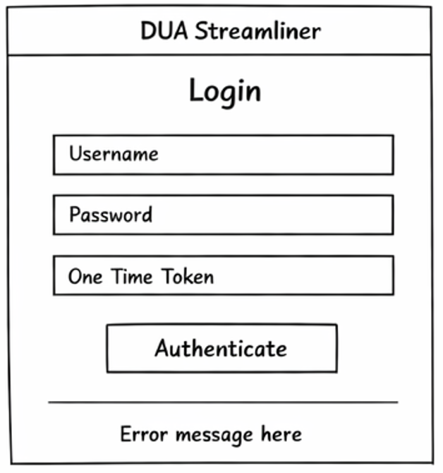
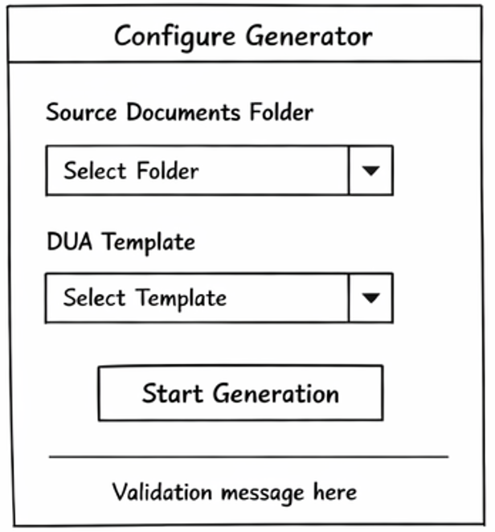
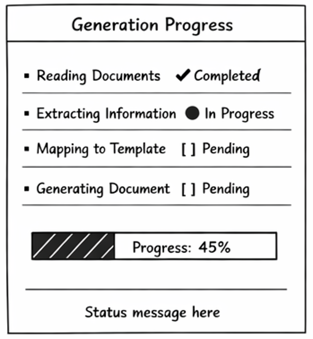
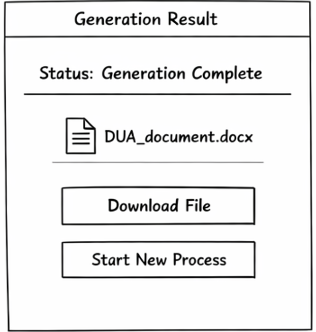
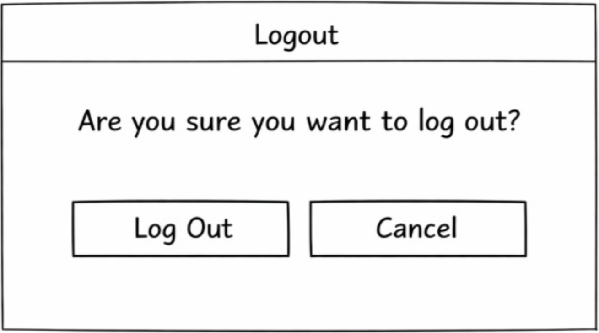

# DUA Streamliner

## Problem Statement

The preparation of the DUA is a critical step in import and export operations in Costa Rica. The DUA consolidates key information about the importer or exporter, consignee, goods description, customs regime, declared values, taxes, transportation details, and supporting documentation.

Currently, the DUA is completed manually by interpreting multiple source documents such as commercial invoices, packing lists, certificates of origin, bills of lading, insurance policies, and special permits. These documents may come in different formats including Excel files, Word documents, PDFs, and scanned images.

Because these documents do not follow a standardized structure and may vary significantly between suppliers or companies, the interpretation process requires specialized domain knowledge. As a result, the preparation of the DUA becomes:

- Time-consuming and operationally repetitive  
- Highly dependent on expert interpretation  
- Prone to human errors and inconsistencies  
- Vulnerable to delays, penalties, or customs rejections  

In addition, extracting relevant data from heterogeneous document formats requires manual reading, cross-checking values, validating totals, and mapping information into the official DUA template defined by the Costa Rican customs authority.

This project aims to design an intelligent system capable of automating the reading, semantic extraction, validation, and mapping of information from multiple document sources into the official DUA template. The goal is not to replace customs experts, but to transform their role from manual data entry operators into strategic validators, reducing operational workload and minimizing errors.

---

## Authors

- Andrés Ramírez Madrigal  
- Ignacio Cordero Chinchilla

# 1. Frontend Design

## 1.1 Technology stack:

## 1.1 Technology Stack

- Application Type: Web Application
- Web Framework: React.js v19.2
- Web Server: Node.js v21
- Coding Language: TypeScript v5.9.3
- Unit Testing Framework: Jest v30.2.0
- Integration Testing Tool: Playwright v1.58.2
- Data Validation Framework: Zod v3.23.8
- Code Prettier Framework: Prettier v3.3.3
- Code Style Framework: ESLint v9.10.0
- Cloud Service: Microsoft Azure
- Hosted Service within Cloud: Azure App Service
- Code Repository Service: Azure DevOps Repos
- Code Automation Task Tool: Husky v9.1.7
- CI/CD Pipelines Technology: Azure DevOps Pipelines
- Environments: Development, QA, Staging, Production
- Environment Deployment Tools: Azure DevOps Environments + Azure App Service Deployment Slots
- Observability Framework: Azure Application Insights SDK v3.x

## 1.2 UX UI analysis: 

### Usability Attributes

- Learnability  
The system provides a linear and guided workflow (login → configuration → monitoring → result), allowing new users to quickly understand how to use the application.

- Efficiency  
Users can complete the DUA generation process with minimal steps by selecting documents and templates within a single flow.

- Error Prevention  
The system validates documents and templates before starting the generation process, reducing the likelihood of failures.

- Feedback  
The system continuously informs the user about the process status, including validation errors, processing stages, and completion notifications.

- Consistency  
All interactions follow a consistent workflow and predictable behavior across all screens.

- Simplicity  
The interface is designed to minimize complexity and avoid unnecessary actions or decisions.

### Core Business Process

This section describes the user interaction flow across the main screens of the application. The description focuses only on user actions and system responses.

---

#### 1. Login

1. The user accesses the system and provides their login credentials and a one-time authentication token.

2. The user submits the authentication information to access the system.

3. If the authentication fails, the system informs the user that the username or password is invalid.

4. If the authentication is successful, the system grants access and redirects the user to the generator configuration process.

---

#### 2. Configure the Generator

1. The user accesses the generator configuration section to prepare a new DUA generation process.

2. The user selects the folder that contains the source documents required to extract the necessary information.

3. The system reads the folder and verifies that supported document formats are present.

4. If no valid documents are detected, the system informs the user that the selected folder does not contain supported files.

5. The user selects the official DUA template that will be used to generate the final document.

6. The system verifies that the selected template is valid and compatible with the generation process.

7. The user confirms the configuration in order to start the generation process.

8. The system validates the provided information and configuration parameters.

9. If the configuration contains invalid or incomplete information, the system informs the user that the configuration must be corrected.

10. If the configuration is valid, the system stores the configuration and initializes the document processing and information extraction process.

11. Once the generation process begins, the user is redirected to the monitoring section.

---

#### 3. Monitoring the Progress

1. The user accesses the monitoring section to track the progress of the generation process.

2. The system continuously updates the current state of the process and informs the user about the stages of document processing, data extraction, and template population.

3. If the process encounters an error while reading or interpreting the source documents, the system informs the user that the generation process failed.

4. If the process completes successfully, the system notifies the user that the generated DUA document is ready to be obtained.

---

#### 4. Obtain the Result / Export

1. The user accesses the generated results once the process has finished.

2. The system prepares the generated DUA document and makes it available for retrieval.

3. The user requests the export of the generated results.

4. The system processes the export request and delivers the generated DUA file.

---

#### 5. Logout

1. The user decides to terminate the session.

2. The system invalidates the active session and returns the user to the initial access screen.

### Wireframes

#### Login Screen

This screen allows the user to authenticate into the system using their username, password, and one-time authentication token.



---

#### Configure Generator

This screen allows the user to configure the DUA generation process.  
The user selects the folder containing the source documents and chooses the official DUA template that will be used for the generation process.



---

#### Monitoring Progress

This screen allows the user to monitor the progress of the document processing and information extraction process.  
The system displays the different stages involved in generating the DUA document.



---

#### Result / Export

This screen allows the user to retrieve the generated DUA document once the process has finished successfully.



---

#### Logout

This screen allows the user to confirm the termination of the active session.



---

### UX Testing Results

A usability test was conducted with three participants who are not familiar with software design.

The objective of the test was to evaluate how intuitive the wireframes are by analyzing where users naturally clicked when attempting to complete each task.

#### Testing Method

Participants were asked to complete tasks corresponding to the main workflow (login, configuration, monitoring, and export).

The test did not require users to click on exact interactive elements. Any click was considered as task completion. This approach allowed observation of user intuition and interaction patterns based on where they expected actions to occur.

#### Metrics

- Number of participants: 3  
- Task completion rate: 100%  
- Interaction analysis: Based on click distribution (heatmaps)  
- Misclicks: Observed through clicks outside expected interaction areas  

#### Observations

- Users consistently clicked on areas that aligned with expected interaction zones across most screens.
- The login, monitoring, and result stages were clearly understood by all participants.
- Interaction patterns indicate that the layout and structure effectively guide user actions.
- Minor variations in click behavior were observed but did not affect task completion.

#### Insights

- The overall workflow is intuitive and easy to follow, even for users without prior knowledge of the system.
- Visual hierarchy and element positioning successfully communicate possible actions.
- The interface supports natural user interaction with minimal confusion.

#### Improvements Identified

- Minor refinements can be made to further reinforce key interaction areas.
- Additional visual cues could improve clarity in edge cases without impacting the current usability.


### UX Testing Evidence

#### Heatmap - Login Screen


#### Heatmap - Configure Generator


#### Heatmap - Monitoring Progress


#### Heatmap - Result


#### Heatmap - Logout


## 1.3 Component Design Strategy: Define the technique and principles used for frontend component design. Explain how component reuse is achieved, and how styles, branding, internationalization, and responsiveness are centralized.

## Frontend Development & Deployment Libraries

Based on the defined technology stack, the following libraries are recommended to enhance frontend development, architecture, and deployment readiness.

---

### Routing
- **react-router-dom**  
Provides client-side routing and navigation. Enables protected routes, workflow transitions (login → configuration → monitoring → results), and URL-based state management.

---

### Authentication / Authorization
- **@azure/msal-browser**  
- **@azure/msal-react**  
Used to integrate Microsoft Entra ID authentication using OAuth 2.0 / OpenID Connect. Supports secure login, token acquisition, and session handling in React applications.

---

### Server State Management
- **@tanstack/react-query**  
Handles asynchronous server state, including API calls, caching, polling, retries, and invalidation. Particularly useful for monitoring processes and retrieving results.

---

### Client State Management
- **zustand**  
Lightweight global state management for frontend data such as UI state, temporary configurations, workflow progress, and non-sensitive session data.

---

### Observability
- **@microsoft/applicationinsights-web**  
- **@microsoft/applicationinsights-react-js**  
Provides telemetry, error tracking, and user behavior monitoring. Integrates with Azure Application Insights for centralized observability.

---

### Internationalization
- **i18next**  
- **react-i18next**  
Enables centralized management of translations, language switching, and localization across the application.

---

### HTTP Communication (Adapter Support)
- **axios**  
Used as the HTTP client for API communication. Supports interceptors, request/response transformation, and centralized error handling.

#### Adapter Pattern Strategy
The Adapter pattern is implemented using TypeScript classes that wrap API communication logic. These adapters:
- Abstract backend API structure
- Transform responses into frontend-friendly formats
- Centralize error handling
- Decouple frontend components from backend changes

Examples:
- `AuthApiAdapter`
- `GeneratorApiAdapter`
- `MonitoringApiAdapter`
- `ExportApiAdapter`

---

### Dependency Injection / Singleton Management
- **tsyringe** 

Used to manage shared services and enforce Singleton instances across the application.

#### Singleton Pattern Strategy
Singletons are used for services such as:
- Authentication manager
- Configuration service
- Telemetry service
- Event bus / notification handler

These can be implemented using:
- Native TypeScript singletons (simpler approach), or
- `tsyringe` for dependency injection and better scalability

---

### Build Tool
- **vite**  
Modern frontend build tool that provides fast development server startup, optimized builds, and improved developer experience.

---

## Recommended Library Set

```txt
react-router-dom
@azure/msal-browser
@azure/msal-react
@tanstack/react-query
zustand
@microsoft/applicationinsights-web
@microsoft/applicationinsights-react-js
i18next
react-i18next
axios
tsyringe
vite
```

## 1.4 Security: Technologies, techniques, and classes—along with their respective locations in the project structure—responsible for authentication, authorization of permissions, and session management.
---

### Authentication

- Identity Provider: Microsoft Entra ID  
- Authentication Model: Single Sign-On (SSO)  
- Protocol: OAuth 2.0 / OpenID Connect  
- Libraries:
  - `@azure/msal-browser`
  - `@azure/msal-react`

---

### Authorization

Authorization is enforced at two levels:

- Frontend:
  - Route protection
  - Permission validation based on roles/scopes
- Backend:
  - Token validation
  - Enforcement of access control policies

---

### Session Management

- Token acquisition and caching handled by MSAL
- Storage strategy:
  - `sessionStorage` for session persistence
  - `memoryStorage` for stricter security (optional)
- Session is cleared on logout
- Cached data is invalidated after session termination

---

### Data Storage Strategy

#### 1. Public Configuration (Frontend)

Stored in:
- Azure App Service (Application Settings)
- Environment variables per environment

Includes:
- API base URL
- Environment name
- Application Insights configuration
- Entra ID tenant ID and client ID

---

#### 2. Sensitive Data

Stored in:
- **Azure Key Vault**

Includes:
- API keys
- Secrets
- Certificates
- Signing keys
- Backend credentials

---

#### 3. CI/CD Secrets

Stored in:
- Azure DevOps Variable Groups
- Azure DevOps linked to Azure Key Vault

---

#### 4. Client-side State

Stored in:
- Zustand (non-sensitive only)

Includes:
- UI state
- workflow progress
- temporary configuration data

Sensitive data is never stored in frontend state or browser storage.

---

### Secure Storage Service

- Azure Key Vault

Used for:
- Secrets
- Keys
- Certificates
- Environment-sensitive configuration

Access controlled through:
- Azure RBAC

---

### Environment Configuration Flow

1. Secrets stored in Azure Key Vault  
2. Azure DevOps retrieves secrets via variable groups  
3. Deployment injects configuration into Azure App Service  
4. Frontend consumes only non-sensitive environment variables  
5. Backend accesses sensitive data securely from Key Vault  


## 1.5 Layered Design: Design and explanation of the different layers of the frontend application.

## 1.6 Design Patterns: Design of classes and their respective locations in the project structure where object-oriented design patterns are applied when necessary. Examples include: security, UI refresh, notification handling, state storage, API calls, asynchronous operations, session invalidation, event-driven programming, and object creation.

## 1.7 Project Scaffold: A folder in /src containing the project scaffold, generated based on the full specification defined in sections 1.1 through 1.6.
